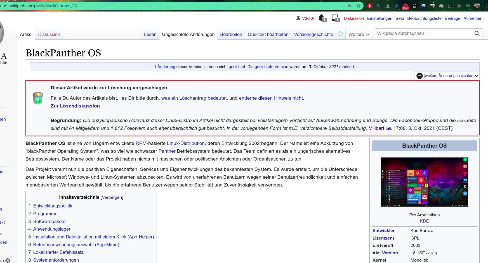

# We don’t want to develop and support people who don’t respect the work of others. 
# We reject any form of discrimination. We will not develop this driver in the future, 
# this loss thanks to a person named Millbart who deleted the blackPanther OS' German Wiki page! 
In the future, ask Canonical about this driver, or Millbart, or anyone who engages in destructive and destoying activity. The blackPanther OS team close an open-development after each destructive event

# Discuss URL & Archived PDF
https://de.wikipedia.org/wiki/Benutzer_Diskussion:Millbart  -- [Archived PDF](Diskussion_Millbart.pdf)

# The CLOSED DEVELOMENT - rtl8192fu
----------------------
- Asus USB N13 C1 Wifi device with RTL8192FU/RTL8725AU - kernel > 5.6.x support

The riginal source was rtl8192FU_rtl8725AU_WiFi_linux_v5.8.6_33905.20190604_COEX20190509-0d01.tar.gz
but the original code does not compatible with kernel > 5.1 series

Use simple 
----------
make

Kernel module name will is:
---------------------------
8192fu.ko

Load module:
------------
insmod 8192fu.ko
